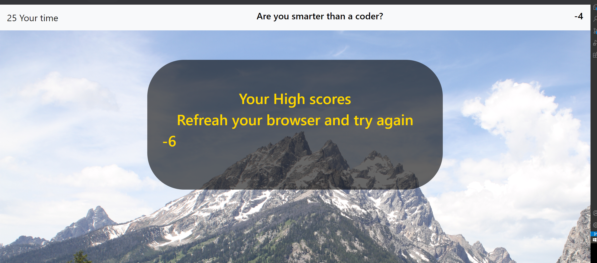

# password-generator

So this was a fun exersize, im definetly need to work on my Javascript skills and need to better understand local storage. The game is built on a Jquery based code that continualy changes Jumbotrons.
Honestly for the best results (for the high score) you should play this game twice...

From working with other people in my class I have seen many diffrent ways to make this work, the reason that I used Jquery was because it just clicked for me. In no way am I saying that I am a pro at it but I get it.
 web file:
 
 https://cloggedbat.github.io/Alvins-hw4-test/
 
How this works

1. Start the game
2. In the corner you will see a timer start
3. Each question you answer wrong you will lose a point and 3 seconds on the clock
4. Answer the questions correctly you will be given a point
5. At the end game you will have your high score shown

I plan on recreating a test in my free time to better understand Javascript fo the the future.

